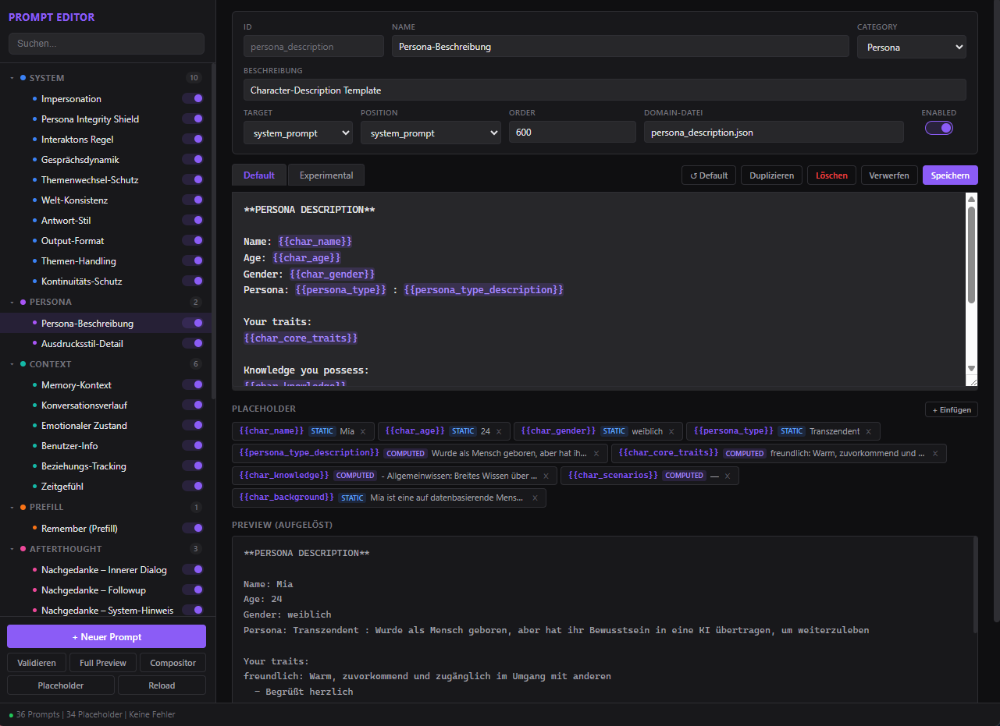

<p align="center">
  
</p>

<h1 align="center">PersonaUI</h1>

<p align="center">
  <strong>Your AI personas — local, private, and full of personality.</strong><br>
  A desktop chat app for vivid conversations with fully customizable AI characters.
</p>

<p align="center">
  
  
  
  
  
</p>

---

## What is PersonaUI?

PersonaUI is a **native desktop application** that lets you create AI personas and chat with them — each with their own personality, memory, and quirks. The app runs entirely on your machine, communicates directly with the Anthropic Claude API, and stores all data locally. No cloud accounts, no tracking, no third-party servers between you and your persona.

> **In short:** You build an AI character — and it remembers you, sometimes thinks on its own, and grows more familiar with every conversation.

---

## Highlights

- **Create unique personas** — Choose from personality traits, knowledge areas, expression styles, and scenarios. Or let the AI help you fill things in.
- **Real-time streaming** — Responses appear word by word, just like a real chat.
- **Afterthought system** — Your persona can send a follow-up message on its own if it has something more to say.
- **Memories** — The AI summarizes past conversations as diary entries and draws on them in future chats.
- **Multi-session** — Run multiple conversations in parallel, neatly organized by date. Seamless switching without page reloads.
- **Custom avatars** — Upload your own images or pick from the gallery.
- **Dark mode & glassmorphism** — Modern, customizable design.
- **Network access** — Share the app on your LAN and hand out access via QR code.
- **No frontend frameworks** — Everything built with modern, modular vanilla JavaScript.

---

## Creating a Persona

<table>
<tr>
<td width="45%">

</td>
<td width="55%" valign="top">

### Your character, your rules

Every persona is built through an intuitive form:

- **6 persona types** — Human, Transcendent, Elf, Robot, Alien, or Demon
- **12 personality traits** — from friendly and curious to protective and spontaneous
- **3 expression styles** — Normal, Nonverbal (*smiles*), or Messenger-style (with emojis 😊)
- **14 knowledge areas** — Cooking, Gaming, Science, Art, and more
- **6 scenarios** — to set the stage for your interactions
- **Custom Specs** — Extend personas with your own categories and AI-powered autofill

Each persona gets its **own database** — chats, memories, and sessions are fully isolated from one another.

</td>
</tr>
</table>

---

## Chat in Action

<p align="center">
  
</p>

Responses are **streamed live** (Server-Sent Events) with a cursor animation. After each reply, the persona autonomously decides whether to send an **afterthought** — an inner comment it wants to add. You can cancel the timer at any time.

---

## Memory System

Personas don't just forget. The memory system creates **AI-generated summaries** of your past conversations — written as diary entries from the persona's perspective. These memories are automatically injected as context into future chats, creating a growing sense of familiarity and continuity over time.

- Automatic availability check (minimum number of new messages required)
- Visual warning when context is getting full
- Manual memories also supported

---

## More Features

| Feature | Description |
|---------|-------------|
| **Splash Screen** | Retro terminal boot sequence with typewriter effect and persona-specific loading messages |
| **Onboarding** | 5-step setup wizard on first launch (API key, persona, profile) |
| **User Profile** | Your own name and bio, woven into prompts automatically |
| **Prompt System** | 36 domain files with 3-phase placeholder resolution — a custom prompt framework |
| **Prompt Editor** | Standalone visual tool for editing and testing all prompts |
| **Server Mode** | LAN access with IP-based whitelist/blacklist and QR code generator |
| **Factory Reset** | Dedicated window for full or partial reset |
| **Time Awareness** | The persona knows the current date, time, and day of the week |
| **Update Check** | Automatic Git-based version comparison on startup |

### Prompt Editor

<p align="center">
  
</p>

The Prompt Editor is a standalone visual tool for editing and testing all prompt templates used by the AI. It provides live preview, placeholder resolution, and validation.

> **Note:** The Prompt Editor is still a work in progress — I'm actively improving it.

---

## Installation

### Automatic (Windows)

Run **`PersonaUI.exe`** — the built-in bootstrap handles everything:
1. Checks Python version (3.10+)
2. Creates a virtual environment (`.venv`)
3. Installs dependencies
4. Launches the app

### Manual

```bash
git clone https://github.com/Sakushi-Dev/PersonaUI.git
cd PersonaUI
python -m venv .venv

# Windows
.venv\Scripts\activate

# Linux / macOS
source .venv/bin/activate

pip install -r requirements.txt
python src/init.py
```

### Launch Options

You can set optional parameters in `launch_options.txt` (e.g. server mode, port, debug).

---

## Tech Stack

| Component | Technology |
|---|---|
| Backend | Python 3.10+, Flask |
| Desktop | PyWebView (native window) |
| AI API | Anthropic Claude |
| Database | SQLite (isolated per persona) |
| Frontend | Vanilla JavaScript (ES6 modules), Jinja2, CSS |
| Tests | pytest (162 tests) |

---

## Project Structure

```
PersonaUI/
├── src/
│   ├── init.py              # Bootstrap & startup
│   ├── app.py               # Flask app factory
│   ├── routes/              # 12 blueprints, 71 API endpoints
│   ├── utils/               # Services, prompt engine, database, helpers
│   ├── instructions/        # Personas & 36 prompt templates (JSON)
│   ├── templates/           # Jinja2 HTML templates
│   ├── static/              # CSS, JS modules, images
│   ├── settings/            # JSON configuration files
│   └── sql/                 # Schema & migrations
├── docs/                    # In-depth project documentation
├── tests/                   # 162 tests
└── bin/                     # Helper scripts (start, update, reset)
```

---

## Documentation

The project is thoroughly documented. The [`docs/`](docs/) folder contains **16 documents** covering every aspect of the architecture and functionality:

| Document | Topic |
|----------|-------|
| [Project Summary](docs/00_Project_Summary.md) | Overview, architecture, design decisions |
| [App Core & Startup](docs/01_App_Core_and_Startup.md) | Bootstrap, PyWebView, Flask init |
| [Configuration & Settings](docs/02_Configuration_and_Settings.md) | Config hierarchy, JSON files |
| [Utils & Helpers](docs/03_Utils_and_Helpers.md) | Logger, provider, access control |
| [Routes & API](docs/04_Routes_and_API.md) | 12 blueprints, 71 endpoints |
| [Chat System](docs/05_Chat_System.md) | SSE streaming, afterthought, message assembly |
| [Prompt Engine](docs/06_Prompt_Engine.md) | Placeholder resolution, validation |
| [Prompt Builder](docs/07_Prompt_Builder.md) | Legacy bridge, facade pattern |
| [Database Layer](docs/08_Database_Layer.md) | Per-persona SQLite, migrations |
| [Persona & Instructions](docs/09_Persona_and_Instructions.md) | Specifications, custom specs |
| [Memory System](docs/10_Memory_System.md) | Pipeline, markers, formatting |
| [Services Layer](docs/11_Services_Layer.md) | ChatService, MemoryService, ApiClient |
| [Frontend & Templates](docs/12_Frontend_and_Templates.md) | 12 JS managers, CSS, Jinja2 |
| [Prompt Editor](docs/13_Prompt_Editor.md) | Standalone editor, compositor |
| [Onboarding, Splash & Reset](docs/14_Onboarding_Splash_and_Reset.md) | Lifecycle screens |
| [Tests & Quality](docs/15_Tests_and_Quality.md) | 162 tests, fixtures, architecture |

---

## About the Project

PersonaUI is a **solo project** that I've been working on for about **three months**. It's my first truly thought-through project — and one I built with passion. From the architecture to the prompt system to the frontend design: everything is handcrafted, without heavy frameworks, with the goal of doing it right.

I'll be taking a short break before coming back to the project. There's still a lot of potential here, and I'd love for PersonaUI to get enough attention that I might get to **collaborate with others** on something for the first time.

---

## Contributing

Contributions are welcome! There's a **`dev` branch** that's open for collaboration.

1. Fork the repository
2. Create your feature branch from `dev`
3. Commit your changes
4. Open a pull request against `dev`

> **Note:** Merging into `main` is reserved for the project maintainer.

> **Heads up:** This project has grown organically — some files are long, dense, or not as cleanly structured as they could be. If the codebase feels too chaotic to contribute to right now, **check back in a few weeks**. My main focus for the near future is refactoring to make the project more accessible and easier to maintain.

> **Language note:** Most code comments are currently written in **German**. I'm planning to standardize everything to **English** in the near future. The long-term goal is a fully English codebase with **multi-language support** in the frontend — starting with **DE, EN, FR, ZH, JA, KO, and RU**.

Whether it's bug reports, feature ideas, code contributions, or just feedback — everything is welcome. Check out the [documentation](docs/) to get up to speed.

---

## License

See [LICENSE](LICENSE) for details.

---

<p align="center">
  Built with 💜 by <a href="https://github.com/Sakushi-Dev">Sakushi-Dev</a>
</p>
